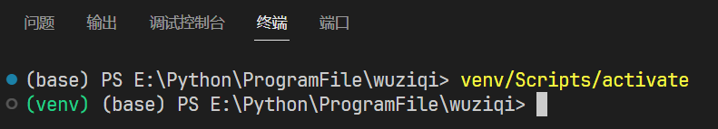

## 1.使用说明
可使用requirements安装依赖，python版本3.10.6  
这里在win10中使用venv创建虚拟环境，如下图所示激活虚拟环境  


### 创建虚拟环境
```python
python -m venv venv
```
这里的python是电脑中系统环境变量中的python，这样虚拟环境的py版本即为环境变量中的py版本。  
第一个venv是指令，第二个是你的环境名称，这样写默认生成在该目录下，要指定生成路径则在后面加路径。  

如果要**指定python版本**，则如下：
```
virtualenv -p E:\Python\SystemFile\python.exe venv
```
上述 "-p E:\Python\SystemFile\python.exe"是指定一个系统上已安装的python解释器。venv是环境名。

### 激活虚拟环境
win中：
```
venv\Scripts\activate
```
### 安装命令
```
pip install -r requirements.txt
```

### 打包和运行
```python
pyinstaller games_v1_pve.py -i="path\你的图标.ico" -F -w -n wuziqi_v1
```
生成的exe文件在dist文件夹中。
exe文件可以脱离python环境运行。

### 打包方法讲解
[使用pyinstaller打包conda环境下多文件的python程序](https://www.yuque.com/u39067637/maezfz/qqm6xavvkp00blyb#L2q2w)

## 2.游戏玩法：
v1版本：五子棋游戏，玩家间对战，单机单鼠标控制，黑棋先行。
v2版本：五子棋游戏，鼠标控制，黑棋先行，人机对战。
